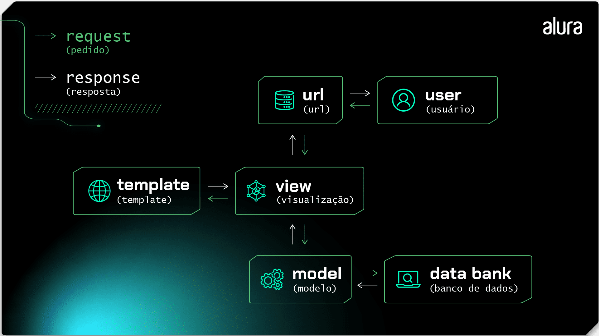

# Resolvi aprender Django 

## O que é django 

1. É uma framework web de código aberto escrita em Python.

2. Segue o Padrão MVT (Model, View, Template)
    - MODEL: **Responsável pela definição e manipulação dos dados**, Inclui a estrutura do banco de dados, as relações entre os diferentes tipos de dados e operações de leitura e escrita.
    
    - VIEW: **Responsável pela lógica de negócios e pela interação com os dados**, processam as requisições dos usuários, acessam os dados do modelo conforme necessário e retornam uma resposta, geralmente em forma de HTML, JSON ou outro formato adequado para o cliente.
    
    - TEMPLATE: **Responsável pela apresentação dos dados ao usuário**, definem a aparência da interface do usuário, misturando HTML com código Python (usando a linguagem de template do Django). Recebem dados das views e os renderizam de forma dinâmica para o usuário final. 

3. Utiliza o ORM (Object-Relational Mapping): Para interagir com o banco de dados de forma orientada a objetos, em vez de escrever SQL diretamente.    

### Interações entre os componentes

1. A interação começa quando o usuário faz uma requisição HTTP através do navegador. Essa requisição é enviada para a URL, que mapeia a URL para a View correspondente.

2. A View processa essa requisição, interagindo com o Model, conforme necessário, para obter ou modificar dados no banco. A View também poderá realizar operações adicionais, como autenticações ou validações.

3. O Model interage com o banco de dados por meio do ORM e executa operações de consulta, atualização, criação ou exclusão de dados no banco de dados. Ele então retorna os dados para as Views que envia para o Template, que insere esses dados no código HTML, enviando para a View uma página HTML renderizada como resposta.

4. A View envia a resposta final para o navegador e o usuário recebe a resposta da aplicação, que é a página HTML com os dados dinâmicos. 

5. Vale ressaltar que há situações em que pode ter views e templates que não precisam interagir diretamente com o model, como páginas estáticas ou páginas de informações e erros personalizadas.



### Como instalar

1. Criar um ambente virtual.

2. Ativar o ambiente virtual e dentro do ambiente executar o comando `pip install django`

3. Criar o arquivo de requirements `pip freeze > requirements.txt`

## Primeiros passos 

1. Se necessário executar o comando ``django-admin help`

2. Iniciar o projeto `django-admin startproject setup .`  isso vai armazenar as configurações do projeto e criar um arquivo manage.py, esse arquivo é responsável por realizar a maioria dos comandos.

3. Se atentar a versão do python sendo utilizada ser a mesma do ambiente virtual.

4. Subir o servidor do projeto `python manage.py runserver`

5. Para interromper o server "Ctrl + c";

6. Tudo que afeta o projeto como um todo vai estar dentro do arquivo settings.py

## Variáveis de ambiente

1. Tem certas coisas no código que a gente não pode subir para o git por causa de segurança. A **SECRET_KEY** é uma delas. Se a gente tentar subir o próprio git avisa.

2. Se a gente remover do código para de funcionar, Então é preciso manter ele no código mas não subir para o git, e as variáveis de ambiente servem para isso.

3. Para resolver isso é preciso baixar um pacote `pip install python-dotenv`, atualiza o requirements e ve se ele ta lá para garantir `pip freeze > requirements.txt`.

4. Após baixar, criar um arquivo `.env` fora da pasta setup e dentro dele colar a variavel de ambiente
`SECRET_KEY = django-insecure-vo6@kr)jgi2o-17s%uz!wfl4!=x1mlg93(5idzi=^!h^ap5kyu`

5. Após isso dentro do arquivo settings.py importar a classe doteenv exemplo abaixo
``` PY
# o "os" é usado para fornecer funcionalidades para manipular as variáveis.

from pathlib import Path, os # from pathlib import Path já estava no arquivo
from dotenv import load_dotenv

load_dotenv() # carrega as variáveis de ambiente.
```

6. Nesse momento as variáveis de ambiente estão carregadas, mas elas só não estão sendo usadas.

7. Para carregar as variáveis de ambiente, no caso a secret_key que é a que eu to vendo
``` PY
SECRET_KEY = str(os.getenv('SECRET_KEY')) # o nome da variavel que eu defini no arq .env    
```

## gitIgnore, "Subir apenas arquivos que eu quero e não todos"

1. Criar um arquivo `.gitignore` fora da pasta setup e venv.

2. O .gitignore é algo muito comum de se fazer, então já existe muitos prontos, e da de pegar eles através do **gitignore.io** um site onde eu coloco a linguagem/framework que estou codando, e ele me fornece um arquivo .gitignore pronto.

3. Copiando esse arq e colando no projeto, na maioria das vezes já da de subir o projeto, mas é importante sempre verificar.